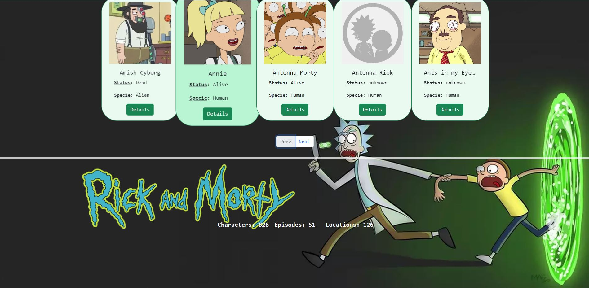

<h1>Descrição</h1>

 
    Esta API é construída para fornecer informações sobre os personagens da famosa série de desenhos animados "Rick and Morty". 
    Ela utiliza a API Rick and Morty para obter dados detalhados sobre os personagens, incluindo informações como nome, status, espécie e muito mais.
     
    Para ver a aplicação <a href="https://gevertonsoares.github.io/Front-RickAndMorty/">Clique aqui</a>
    

<h5>Design da Página</h5>

 
<h5>Paginação</h5>

 
<h5>Detalhes dos Personagens</h5>

